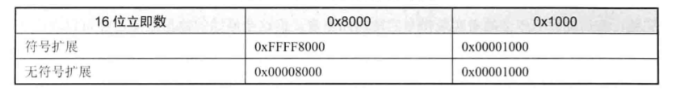
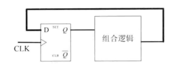
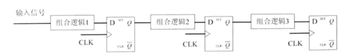
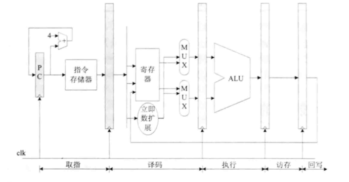

##### 数据类型

指令的主要任务是对操作数进行计算，操作数有不同的类型和长度，MIPS32提供的基本数据类型如下：

位（b）：长度是1 bit

字节（Byte）：长度是8 bit

半字（Half Word）：长度是16 Bit

字（Word）：长度是32 Bit

双字（Double Word）：长度是64 Bit

##### OPENMIPS五级流水线各阶段主要工作

**取指阶段**：从指令存储器读出指令，同时确定下一条指令地址

**译码阶段**：对指令进行译码，从通用寄存器中读出要使用的寄存器的值，如果指令中含有立即数，那么还要将立即数进行符号扩展或无符号扩展。如果是转移指令，并且满足转移条件，那么给出转移目标，作为新的指令地址。

**执行阶段**：按照译码阶段给出的操作数、运算类型，进行运算，给出运算结果。如果是Load/Store指令，那么还会计算Load/Store的目标地址。

**访存阶段**：如果是Load/Store指令，那么在此阶段会访问数据存储器，反之，只是将执行阶段的结果向下传递到回写阶段。同时，在此阶段还要判断是否有异常需要处理，如果有，那么会清除流水线，然后转移到异常处理例程入口地址处继续执行。

**回写阶段**：将运算结果保存到目标寄存器。

##### 教学版OPENMIPS处理器接口

教学版OPENMIPS处理器的外部接口如上图所示，左边是输入接口，右边是输出接口，可以分为三类，包括系统控制接口（包括复位、时钟、中断）、指令存储器接口、数据存储器接口。

##### 只实现一条指令ori时的数据流图如上图所示。

#### Chapter 4 第一条指令ori的实现

##### ori指令格式

从指令格式可以看出，这是一个I类型的指令，ori指令的指令码是6'b001101，所以当处理器发现正在处理的指令的高6bit是6'b001101时，就知道正在处理的是ori指令。

指令的用法是ori,rs,rt,immediate,作用是将指令中的16位立即数immediate进行无符号扩展至32位，然后与索引为rs的通用寄存器的值进行逻辑“或”运算，运算结果保存到索引为rt的通用寄存器中。

###### （1）无符号扩展

在MIPS32指令集架构中，经常会有指令需要将其中的立即数进行符号扩展或者无符号扩展，一般都是将n位立即数扩展为32位，其中，符号扩展是将n位立即数的最高位复制到扩展后的32位数据的高（32-n）位，无符号扩展则是将扩展后的32位数据的高（32-n）位都置为0。

以将指令中的16位立即数扩展为32位为例，下图给出了当16位立即数分别是0x8000和0x1000时的符号扩展、无符号扩展的结果。

###### （2）通用寄存器

在MIPS32指令集架构中定义了32个通用寄存器$0~$31，OPENMIPS实现了这32个通用寄存器，使用某一个通用寄存器只需要会给出相应索引，这个索引占用5bit，ori指令中的rs、rt就是通用寄存器的索引，例如当rs为5'b00011时，就表示通用寄存器$3。

#### 流水线结构的建立

##### 流水线的简单模型

寄存器按照给定时间脉冲来进行时序同步操作，其使得时序逻辑电路具有记忆功能。如果寄存器的输出端和输入端存在环路，这样的电路称为“状态机”，状态机的简单模型如下图所示。

而如果寄存器之间有连接，而没有上述环路，这样的电路结构称为“流水线”，流水线的简单模型如下图所示。

在流水线结构中，信号在寄存器之间传递，每传递到一级都会引起相应的组合逻辑电路，对这种模型进行抽象描述就是寄存器传输级（Register Transfer Level，RTL）。

##### 原始的OPENMIPS五级流水线结构

通过对上图的扩充，可以得到OPENMIPS的原始数据流图，如下图所示。

上图中深色的部分对应的是前图中提到的D触发器，深色部分之间的部分对应的是组合逻辑。各个阶段完成的主要工作如下：

取指：取出指令存储器中的指令，PC值递增，准备取下一条指令。

译码：对指令进行译码，依据译码结果，从32个通用寄存器中取出源操作数，有的指令要求两个源操作数都是寄存器的值，比如or指令，有的指令要求其中一个源操作数是指令中立即数的扩展，比如ori指令，所以这里有两个复用器，用于依据指令要求，确定参与运算的操作数，最终确定的两个操作数会送到执行阶段。

执行阶段：依据译码阶段送入的源操作数、操作码，进行计算，对于ori指令而言，就是进行逻辑“或”运算，运算结果