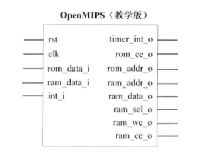
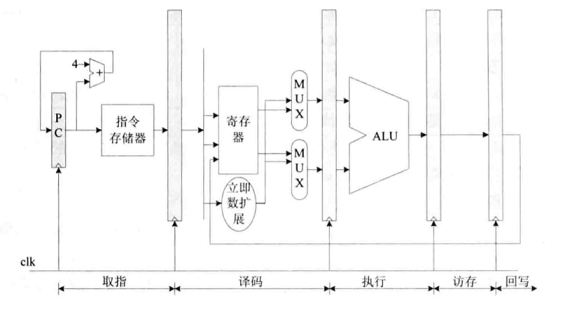
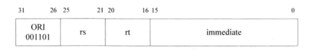

##### 数据类型

指令的主要任务是对操作数进行计算，操作数有不同的类型和长度，MIPS32提供的基本数据类型如下：

位（b）：长度是1 bit

字节（Byte）：长度是8 bit

半字（Half Word）：长度是16 Bit

字（Word）：长度是32 Bit

双字（Double Word）：长度是64 Bit

##### OPENMIPS五级流水线各阶段主要工作

**取指阶段**：从指令存储器读出指令，同时确定下一条指令地址

**译码阶段**：对指令进行译码，从通用寄存器中读出要使用的寄存器的值，如果指令中含有立即数，那么还要将立即数进行符号扩展或无符号扩展。如果是转移指令，并且满足转移条件，那么给出转移目标，作为新的指令地址。

**执行阶段**：按照译码阶段给出的操作数、运算类型，进行运算，给出运算结果。如果是Load/Store指令，那么还会计算Load/Store的目标地址。

**访存阶段**：如果是Load/Store指令，那么在此阶段会访问数据存储器，反之，只是将执行阶段的结果向下传递到回写阶段。同时，在此阶段还要判断是否有异常需要处理，如果有，那么会清除流水线，然后转移到异常处理例程入口地址处继续执行。

**回写阶段**：将运算结果保存到目标寄存器。

##### 教学版OPENMIPS处理器接口

教学版OPENMIPS处理器的外部接口如上图所示，左边是输入接口，右边是输出接口，可以分为三类，包括系统控制接口（包括复位、时钟、中断）、指令存储器接口、数据存储器接口。

##### 只实现一条指令ori时的数据流图如上图所示。

#### Chapter 4 第一条指令ori的实现

##### ori指令格式

从指令格式可以看出，这是一个I类型的指令，ori指令的指令码是6'b001101，所以当处理器发现正在处理的指令的高6bit是6'b001101时，就知道正在处理的是ori指令